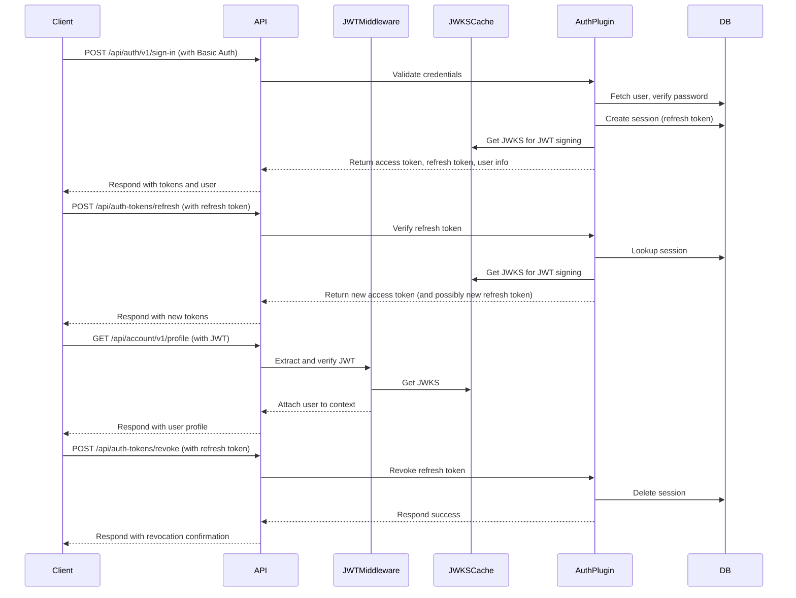

# Astro Starter Kit

A feature-rich web application starter template built with Astro, Svelte, TailwindCSS, Better Auth, Drizzle ORM.

## 🚀 Tech Stack

- **[Astro](https://astro.build)** - Fast, modern web framework
- **[Svelte](https://svelte.dev)** - UI component library used for component hydration
- **[TailwindCSS](https://tailwindcss.com)** - Utility-first CSS framework v4
  - With Typography plugin for elegant content styling
- **[Shadcn UI](https://next.shadcn-svelte.com)** - UI component library
- **[Better Auth](https://better-auth.com)** - Authentication system
- **[Drizzle ORM](https://orm.drizzle.team)** - TypeScript ORM
- **[Resend](https://resend.com)** - Modern email API for sending emails
- **[Hono](https://hono.dev)** - Lightweight, ultrafast web framework for API endpoints

## 🛠️ Features

- **Server-side Rendering** with Astro's Cloudflare adapter
- **Type Safety** with TypeScript
- **User Authentication** flow with Better Auth
- **Database Integration** with Drizzle ORM and Cloudflare D1
- **Modern UI** with TailwindCSS v4
- **Email Functionality** with Resend API and templating using React Email
- **Development Tools**: Prettier for code formatting
- **API Layer**: Built with Hono for efficient request handling
- **Internationalization**: Type-safe i18n with consistent naming conventions and locale-aware URLs

## Getting Started

```bash
pnpm install
cp .dev.vars.example .dev.vars # For local development secrets
pnpm run dev
```

## ☑️ New Project Checklist

- [ ] Copy `.dev.vars.example` to `.dev.vars` and add secrets like `BETTER_AUTH_SECRET` and `RESEND_API_KEY` for local development.
- [ ] Create a KV namespace for sessions using `pnpm wrangler kv namespace create "SESSION"` and add the binding to `wrangler.jsonc`.
- [ ] Update `wrangler.jsonc` with your project name, D1 database details, and variables like `BETTER_AUTH_BASE_URL` and `SEND_EMAIL_FROM`.
- [ ] Update project name in `package.json`
- [ ] Update database schema.
- [ ] Create a D1 database in Cloudflare and add its `binding`, `database_name`, and `database_id` to `wrangler.jsonc`.
- [ ] Run `pnpm db:init:local` to initialize the local database.
- [ ] Run `pnpm db:init:prod` to initialize the production database.
- [ ] Regenerate migrations using `pnpm db:generate`.
- [ ] Set `BETTER_AUTH_SECRET` secret using `pnpm wrangler secret put BETTER_AUTH_SECRET` for production.
- [ ] Set `RESEND_API_KEY` secret using `pnpm wrangler secret put RESEND_API_KEY` for production.
- [ ] Require email verification on sign up.

## 🧞 Commands

| Command                 | Action                                   |
| :---------------------- | :--------------------------------------- |
| `pnpm install`          | Installs dependencies                    |
| `pnpm dev`              | Starts local dev server with DB setup    |
| `pnpm build`            | Build your production site with DB setup |
| `pnpm astro`            | Run Astro CLI commands                   |
| `pnpm db:generate`      | Generate Drizzle migrations              |
| `pnpm d1:migrate:local` | Apply migrations locally                 |
| `pnpm d1:migrate:prod`  | Apply migrations to production           |
| `pnpm d1:studio:local`  | Run Drizzle Studio for local development |
| `pnpm preview-email`    | Start email template preview server      |

### AI-assisted Bootstrap

This project comes with a script that can help you bootstrap a new project.
The script uses Claude Code to rename the project, update the README, and update the project name in the code.

To use the script, run `node scripts/bootstrap.js <project-name>`.

> [!IMPORTANT]
> The script assumes you have a working installation of Claude Code.
> if you don't have or rather use another tool, you can run the script with the `--prompt-only` flag to get the prompt and apply it manually in your favorite AI tooling.

## 🔐 Authentication

This template uses Better Auth for authentication. And supports these features out of the box:

1. **Sign Up**: Users can create an account with name, email, and password
2. **Sign In**: Users can log in with their email and password
3. **Protected Routes**: The dashboard is protected and requires authentication
4. **Sign Out**: Users can log out from their account
5. **Email Verification**: Users can verify their email address
6. **Password Reset**: Users can reset their password
7. **Account Deletion**: Users can delete their account

> [!IMPORTANT]
> By default, email verification is not required to sign in. You may want to change this behavior in `src/lib/auth.ts`.

### Better Auth

You **must** set the `BETTER_AUTH_SECRET` secret in your production environment (e.g., Cloudflare Pages). If this variable is not set, Better Auth will throw an error.

For local development, you can add this variable to the `.dev.vars` file (copied from `.dev.vars.example`).

You can generate a secure secret using OpenSSL:

```bash
openssl rand -base64 32
```

Copy the generated string. Then, add it as a secret named `BETTER_AUTH_SECRET` using wrangler CLI for your production environment:

```bash
pnpm wrangler secret put BETTER_AUTH_SECRET
```

Also configure `BETTER_AUTH_BASE_URL` in your `wrangler.jsonc` file under the `vars` section for production.

### Resend

This template uses Resend for email functionality.
During development, emails are sent via SMTP to Ethereal if `RESEND_API_KEY` is not set in `.dev.vars`.

To set up Resend for production, create an account and set the `RESEND_API_KEY` secret using wrangler CLI:

```bash
pnpm wrangler secret put RESEND_API_KEY
```

For local development, add `RESEND_API_KEY` to your `.dev.vars` file if you want to use Resend.
The sender email address (`SEND_EMAIL_FROM`) should be configured in your `wrangler.jsonc` file under the `vars` section for production.

### Astro Session

The Astro Sessions API allows you to easily store user data between requests.
This can be used for things like user data and preferences, shopping carts, and
authentication credentials. Unlike cookie storage, there are no size limits on
the data, and it can be restored on different devices.

Before using sessions, you need to create a KV namespace to store the data and
configure a KV binding in your Wrangler config file.

```bash
pnpm wrangler kv namespace create "SESSION" # default name
```

Add the returned ID to `wrangler.jsonc`:

```jsonc
"kv_namespaces": [
  {
    "binding": "SESSION",
    "id": "<KV_NAMESPACE_ID>"
  }
]
```

## 🗄️ Database

This template uses Drizzle ORM with Cloudflare D1 for a modern, type-safe, serverless SQL database.

- The schema is defined using Drizzle's sqliteTable helpers for tables.
- The Drizzle config (`drizzle.config.ts`) uses the local D1 database specified in `.wrangler/state/v3/d1` for Drizzle Kit commands like `db:generate`. It does not require separate Cloudflare credentials for local development.

### Database Schema

The database schema includes:

- Users
- Sessions
- Accounts
- Verification tokens

### Creating a D1 Database

To create a D1 database for your project:

```bash
# Initialize the local database for development
pnpm db:init:local

# Create a D1 database in Cloudflare for production
pnpm db:init:prod

# After creating the database, you'll receive output with the database_id
# Add this to your wrangler.jsonc as shown in the example below
```

Example wrangler.jsonc configuration:

```jsonc
"d1_databases": [
  {
    "binding": "DB", // Must match preview_database_id
    "database_name": "your-project-name",
    "database_id": "your-d1-database-id", // The ID from the create command
    "migrations_dir": "./drizzle/migrations",
    "preview_database_id": "DB" // Required for Pages local development
  }
]
```

### Migrations

- Run `pnpm db:generate` to generate migrations from your schema.
- Run `pnpm d1:migrate:local` to apply them locally.
- Run `pnpm d1:migrate:prod` to apply them to production.

See the checklist above for more details.

> **Note:** You need to manually apply the migrations to your production database after every schema change.

### Studio

You can use the Drizzle Studio to view and edit your local database data.

```bash
pnpm d1:studio:local
```

## 📊 Database Queries

Here's an example of how to query the database using Drizzle ORM:

```typescript
import {createDrizzle} from "@/db";

const db = createDrizzle(d1); // You can obtain and instance of D1Database from the context using the DB binding.
const userData = await db.select().from(user).where(eq(user.id, userId));

// Create a new user
const newUser = await db
  .insert(user)
  .values({
    name: "John Doe",
    email: "john@example.com"
    // Other user fields
  })
  .returning();

// Join example: Fetch user with their active sessions
const userWithSessions = await db
  .select({
    id: user.id,
    name: user.name,
    sessionId: session.id
  })
  .from(user)
  .leftJoin(session, eq(session.userId, user.id))
  .where(eq(user.id, userId));
```

## 📨 Email Functionality

The application includes built-in email functionality using [Resend](https://resend.com) (if `RESEND_API_KEY` is set via wrangler secrets or `.dev.vars`) with fallback to SMTP/Ethereal for development.

### Configuration

For production, configure the following:

- Set the `RESEND_API_KEY` secret using `pnpm wrangler secret put RESEND_API_KEY`.
- Set the `SEND_EMAIL_FROM` variable in `wrangler.jsonc` under `vars`.

For local development:

- Add `RESEND_API_KEY` to your `.dev.vars` file. If omitted, the app will fall back to using Ethereal via SMTP.
- The `SEND_EMAIL_FROM` variable from `wrangler.jsonc` will be used if available during `wrangler dev`.

### Email Templates

Email templates are built with React Email for improved type safety, maintainability, and design consistency. Templates are stored in `src/components/email/`:

- `WelcomeEmail.tsx` - Template for welcome emails
- `CustomEmail.tsx` - Template for custom message emails
- `BaseLayout.tsx` - Reusable email layout component
- `EmailVerification.tsx` - Template for email verification
- `PasswordReset.tsx` - Template for password reset emails
- `ChangeEmailVerification.tsx` - Template for email change verification
- `AccountDeleted.tsx` - Template for account deletion confirmation

### Sending Emails

```typescript
import {sendEmail} from "@/actions/email";

// Send a welcome email
await sendEmail({
  to: "user@example.com",
  subject: "Welcome to Astro Starter!",
  template: {name: "welcome", params: {name: "John"}}
});

// Send a custom email
await sendEmail({
  to: "user@example.com",
  subject: "Important Information",
  template: {name: "custom", params: {html: "<p>Your custom message here</p>"}}
});
```

### Sending Test Emails

Visit `/email-demo` to try the email functionality. In development, emails are sent to Ethereal (a test SMTP service) and you'll see preview links in the console.

### Preview Emails Templates

To preview emails locally, run:

```bash
pnpm preview-email
```

This command starts a local email viewer using the templates from the `src/components/email` directory.

## API

The API is built using Hono and comes with a hybrid JWT and refresh token authentication system, primarily for mobile applications. The API endpoints are organized in the `src/lib/hono/routes` directory.

Key features:

- JWT-based authentication
- Route protection using middlewares
- Structured response handling
- Integration with the Drizzle ORM database

API routes include:

- Authentication routes (`/api/auth/*`)
- User account management
- JWT refresh and token management



## Cloudflare Configuration

This template is configured to deploy to Cloudflare Pages with D1 Database and KV storage.

### Local Development

For local development, the template uses Wrangler to emulate Cloudflare's environment. Use `pnpm dev` which runs `wrangler dev`. Environment variables for local development can be placed in `.dev.vars`. Secrets like API keys should generally be kept out of version control. The `platformProxy` option in the Astro config makes this seamless.

### Production Deployment

To deploy to Cloudflare Workers with static assets:

1. Create a new Workers project in the Cloudflare dashboard
2. Link it to your GitHub repository
3. Configure the build command: `pnpm build`
4. Configure production environment variables and secrets (like `BETTER_AUTH_SECRET`, `RESEND_API_KEY`) in the Pages dashboard settings.
5. Migrate the production database.
6. Deploy!

> [!NOTE]
> Cloudflare Pages is not supported for this project.
> Attempts to deploy end up in a `[ERROR] Error: No such module "node:os".` error.
> This could be temporary, but as of 2025-05-04, it is not supported.

## 🎨 Theming

This project uses TailwindCSS for styling.
The shadcn theme is defined in `src/styles.css`.

You can generate a new theme using your favorite tool ([example](https://themecn.dev/))
then copy-paste the variables.

## 📚 Learn More

- [Astro Documentation](https://docs.astro.build)
- [Better Auth Documentation](https://github.com/zenstackhq/better-auth)
- [Drizzle ORM Documentation](https://orm.drizzle.team/docs/overview)
- [TailwindCSS Documentation](https://tailwindcss.com/docs)
- [Svelte Documentation](https://svelte.dev/docs)
- [Resend Documentation](https://resend.com/docs)
- [React Email](https://react.email/docs/introduction)

## Resources

- [Shadcn UI Blocks](https://www.shadcnui-blocks.com/)
