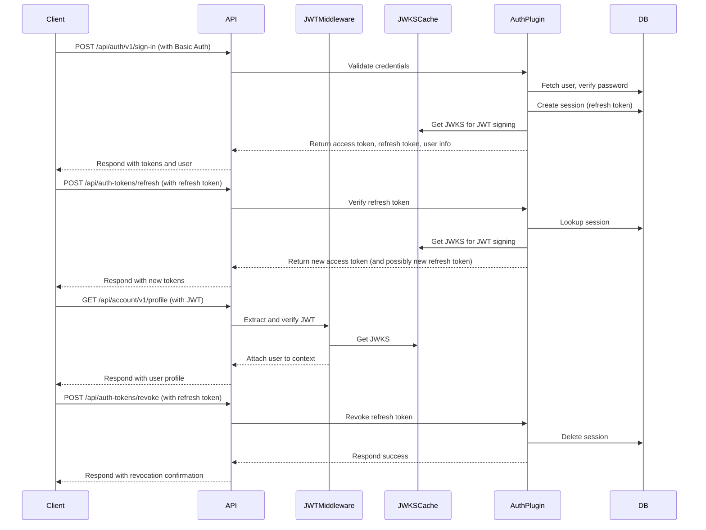

# 🪻 Indigo Stack — Web Full-stack

Indigo Stack is a free, open-source web application starter template built with Astro, React, TailwindCSS, Better Auth, and Drizzle ORM.

## Tech Stack

- **[Astro](https://astro.build)** - Fast, modern web framework
- **[React](https://react.dev)** - UI component library used for component hydration
- **[TailwindCSS](https://tailwindcss.com)** - Utility-first CSS framework v4
  - With Typography plugin for elegant content styling
- **[Shadcn UI](https://ui.shadcn.com)** - UI component library
- **[Better Auth](https://better-auth.com)** - Authentication system
- **[Drizzle ORM](https://orm.drizzle.team)** - TypeScript ORM
- **[Drizzle Kit](https://orm.drizzle.team/docs/cli)** - CLI tool for managing Drizzle ORM migrations and database schema
- **[Plunk](https://useplunk.com)** - Modern email API for sending emails
- **[Hono](https://hono.dev)** - Lightweight, ultrafast web framework for API endpoints
- **[Cloudflare D1](https://developers.cloudflare.com/d1)** - Serverless database for modern applications
- **[React Email](https://react.email)** - Email templating library for React
- **[Prettier](https://prettier.io)** - Code formatter for consistent code style
- **[Wrangler](https://developers.cloudflare.com/workers/wrangler)** - CLI tool for managing Cloudflare Workers and D1 databases

## Features

- **Deploy to Cloudflare Workers** with D1 database support.
- **Server-side Rendering** with Astro's Cloudflare adapter.
- **Type Safety** with TypeScript.
- **User Authentication** flow with Better Auth.
- **Database Integration** with Drizzle ORM and Cloudflare D1.
- **Modern UI** with TailwindCSS v4.
- **Email Functionality** with Plunk API and templating using React Email.
- **Development Tools**: Prettier for code formatting.
- **API Layer**: Built with Hono for efficient request handling.
- **Internationalization**: Type-safe i18n with consistent naming conventions and locale-aware URLs.

## Getting Started

```bash
pnpm install
cp .dev.vars.example .dev.vars # For local development secrets
pnpm cf-types # Install Cloudflare types
pnpm run dev           # Astro dev server (Node runtime)
pnpm run preview       # Cloudflare Workers emulation via Wrangler
```

## Commands

| Command                 | Action                                   |
| :---------------------- | :--------------------------------------- |
| `pnpm install`          | Installs dependencies                    |
| `pnpm dev`              | Starts local dev server with DB setup    |
| `pnpm build`            | Build your production site with DB setup |
| `pnpm astro`            | Run Astro CLI commands                   |
| `pnpm db:generate`      | Generate Drizzle migrations              |
| `pnpm db:migrate:local` | Apply migrations locally                 |
| `pnpm db:migrate:prod`  | Apply migrations to production           |
| `pnpm db:studio:local`  | Run Drizzle Studio for local development |
| `pnpm preview-email`    | Start email template preview server      |
| `pnpm email-worker:dev` | Start email queue worker in dev mode     |
| `pnpm email-worker:deploy` | Deploy email queue worker to production |
| `pnpm queue:create`     | Create Cloudflare queues for emails     |

### AI-assisted Bootstrap

This project comes with a script that can help you bootstrap a new project.
The script uses Claude Code to rename the project, update the README, and update the project name in the code.

To use the script, run `node scripts/bootstrap.js <project-name>`.

> [!IMPORTANT]
> The script assumes you have a working installation of Claude Code.
> if you don't have or rather use another tool, you can run the script with the `--prompt-only` flag to get the prompt and apply it manually in your favorite AI tooling.

## Authentication

This template uses Better Auth for authentication. And supports these features out of the box:

1. **Sign Up**: Users can create an account with name, email, and password
2. **Sign In**: Users can log in with their email and password
3. **Protected Routes**: The dashboard is protected and requires authentication
4. **Sign Out**: Users can log out from their account
5. **Email Verification**: Users can verify their email address
6. **Password Reset**: Users can reset their password
7. **Account Deletion**: Users can delete their account

> [!IMPORTANT]
> By default, email verification is not required to sign in. You may want to change this behavior in `src/lib/auth.ts`.

### Test Credentials (Development)

For local development and testing, you can use these

- **Email**: `test@example.com`
- **Password**: `TestPassword123!`

> [!NOTE]
> No test user is created by default. You'll need to sign up through the `/sign-up` page to create your first account. Feel free to use different credentials if preferred.
> If you're using the placeholder `PLUNK_API_KEY=test-key` in `.dev.vars`, email verification emails will not be sent during sign-up. The auth configuration automatically detects this and disables email sending to prevent errors. Users created this way will need their email manually verified in the database for testing purposes (e.g., `UPDATE user SET emailVerified = 1 WHERE email = 'your@email.com'`).

### Better Auth

You **must** set the `BETTER_AUTH_SECRET` secret in your production environment (e.g., Cloudflare Pages). If this variable is not set, Better Auth will throw an error.

For local development, you can add this variable to the `.dev.vars` file (copied from `.dev.vars.example`).

You can generate a secure secret using OpenSSL:

```bash
openssl rand -base64 32
```

Copy the generated string. Then, add it as a secret named `BETTER_AUTH_SECRET` using wrangler CLI for your production environment:

```bash
pnpm wrangler secret put BETTER_AUTH_SECRET
```

Also configure `BETTER_AUTH_BASE_URL` in your `wrangler.jsonc` file under the `vars` section for production.

### Plunk

This template uses [Plunk](https://useplunk.com) for email functionality.

To set up Plunk for production, create an account and set the `PLUNK_API_KEY` secret using wrangler CLI:

```bash
pnpm wrangler secret put PLUNK_API_KEY
```

For local development, add `PLUNK_API_KEY` to your `.dev.vars` file.
The sender email address (`SEND_EMAIL_FROM`) should be configured in your `wrangler.jsonc` file under the `vars` section for production.

### Astro Session

The Astro Sessions API allows you to easily store user data between requests.
This can be used for things like user data and preferences, shopping carts, and
authentication credentials. Unlike cookie storage, there are no size limits on
the data, and it can be restored on different devices.

Before using sessions, you need to create a KV namespace to store the data and
configure a KV binding in your Wrangler config file.

```bash
pnpm wrangler kv namespace create "SESSION" # default name
```

Add the returned ID to `wrangler.jsonc`:

```jsonc
"kv_namespaces": [
  {
    "binding": "SESSION",
    "id": "<KV_NAMESPACE_ID>"
  }
]
```

## Database

This template uses Drizzle ORM with Cloudflare D1 for a modern, type-safe, serverless SQL database.

- The schema is defined using Drizzle's sqliteTable helpers for tables.
- The Drizzle config (`drizzle.config.ts`) uses the local D1 database specified in `.wrangler/state/v3/d1` for Drizzle Kit commands like `db:generate`. It does not require separate Cloudflare credentials for local development.

### Database Schema

The database schema includes:

- Users
- Sessions
- Accounts
- Verification tokens

### Creating a D1 Database

To create a D1 database for your project:

```bash
# Initialize the local database for development
pnpm db:init:local

# Create a D1 database in Cloudflare for production
pnpm db:init:prod

# After creating the database, you'll receive output with the database_id
# Add this to your wrangler.jsonc as shown in the example below
```

Example wrangler.jsonc configuration:

```jsonc
"d1_databases": [
  {
    "binding": "DB", // Must match preview_database_id
    "database_name": "your-project-name",
    "database_id": "your-d1-database-id", // The ID from the create command
    "migrations_dir": "./drizzle/migrations",
    "preview_database_id": "DB" // Required for Pages local development
  }
]
```

### Migrations

- Run `pnpm db:generate` to generate migrations from your schema.
- Run `pnpm db:migrate:local` to apply them locally.
- Run `pnpm db:migrate:prod` to apply them to production.

See the checklist above for more details.

> **Note:** You need to manually apply the migrations to your production database after every schema change.

### Studio

You can use the Drizzle Studio to view and edit your local database data.

```bash
pnpm db:studio:local
```

### Queries

Here's an example of how to query the database using Drizzle ORM:

```typescript
import {createDrizzle} from "@/db";

const db = createDrizzle(d1); // You can obtain and instance of D1Database from the context using the DB binding.
const userData = await db.select().from(user).where(eq(user.id, userId));

// Create a new user
const newUser = await db
  .insert(user)
  .values({
    name: "John Doe",
    email: "john@example.com"
    // Other user fields
  })
  .returning();

// Join example: Fetch user with their active sessions
const userWithSessions = await db
  .select({
    id: user.id,
    name: user.name,
    sessionId: session.id
  })
  .from(user)
  .leftJoin(session, eq(session.userId, user.id))
  .where(eq(user.id, userId));
```

## Emails

The application uses an **asynchronous email queue system** powered by Cloudflare Queues. Emails are queued immediately and processed by a separate worker with its own CPU budget, preventing email sending from blocking user requests.

### Architecture

```
Request → queue.send(email) → Response (fast!)
              ↓
   [Email Queue Worker]
              ↓
   render(template) → send via Plunk
```

**Benefits:**
- Fast response times (no email rendering on request path)
- Automatic retries with exponential backoff
- Dead letter queue for failed messages
- Separate CPU budget for email processing
- Built-in batch processing

### Setup

#### 1. Create Cloudflare Queues

```bash
pnpm queue:create
```

This creates:
- `indigo-email-queue` - Primary queue for email messages
- `indigo-email-queue-dlq` - Dead letter queue for failed messages

#### 2. Configure Worker Secret

The email worker needs the Plunk API key:

```bash
npx wrangler secret put PLUNK_API_KEY --config indigo-email-queue-consumer/wrangler.jsonc
```

#### 3. Deploy Worker

```bash
pnpm email-worker:deploy
```

#### 4. Configure Main App

The main app configuration in `wrangler.jsonc` includes:

- Queue producer binding (`EMAIL_QUEUE`)
- Sender email address (`SEND_EMAIL_FROM`)

### Configuration

**Production:**

- Set `PLUNK_API_KEY` secret on the worker (step 2 above)
- Configure `SEND_EMAIL_FROM` in worker's `wrangler.jsonc`
- Deploy worker before deploying main app

**Local Development:**

- In dev mode, emails are logged to console (not actually queued)
- Optional: Run `pnpm email-worker:dev` in separate terminal to process queued emails locally
- Add `PLUNK_API_KEY` to `.dev.vars` if testing actual email delivery

### Email Templates

Email templates are built with React Email and include **localization support** (English and Japanese). Templates are stored in `src/components/email/`:

- `WelcomeEmail.tsx` - Welcome emails with locale-specific text
- `CustomEmail.tsx` - Custom message emails
- `BaseLayout.tsx` - Reusable email layout component
- `EmailVerification.tsx` - Email verification with translations
- `PasswordReset.tsx` - Password reset with translations
- `AccountDeleted.tsx` - Account deletion confirmation with translations

All templates support a `locale` prop to render content in the user's preferred language.

### Sending Emails

Emails are queued using the `queueEmail()` function:

```typescript
import {queueEmail} from "@/lib/email";

// Queue a welcome email
await queueEmail(
  "user@example.com",
  {type: "welcome", props: {name: "John"}},
  env,
  {locale: "en"} // Optional locale for translations
);

// Queue a custom email
await queueEmail(
  "user@example.com",
  {type: "custom", props: {html: "<p>Your message</p>"}},
  env,
  {subject: "Custom Subject", locale: "ja"}
);
```

The email is immediately queued and returns. The worker processes it asynchronously.

### Monitoring

**View worker logs:**
```bash
wrangler tail indigo-email-queue-consumer
```

**Check queue metrics:**
- Navigate to Cloudflare dashboard → Workers & Pages → Queues
- Monitor message throughput, consumer latency, and failed messages
- Dead letter queue captures messages that fail after max retries

### Preview Emails Templates

To preview emails locally, run:

```bash
pnpm preview-email
```

This command starts a local email viewer using the templates from the `src/components/email` directory.

## API

The API is built using Hono and comes with a hybrid JWT and refresh token authentication system, primarily for mobile applications. The API endpoints are organized in the `src/lib/hono/routes` directory.

Key features:

- JWT-based authentication
- Route protection using middlewares
- Structured response handling
- Integration with the Drizzle ORM database

API routes include:

- Authentication routes (`/api/auth/*`)
- User account management
- JWT refresh and token management



## Cloudflare Configuration

This template is configured to deploy to Cloudflare Pages with D1 Database and KV storage.

### Local Development

For local development, choose between two workflows:

- `pnpm dev` - Astro dev server (Node runtime, faster development)
- `pnpm preview` - Cloudflare Workers emulation via Wrangler (production parity)

Environment variables for local development can be placed in `.dev.vars`. Secrets like API keys should generally be kept out of version control. The `platformProxy` option in the Astro config makes this seamless.

### Production Deployment

To deploy to Cloudflare Workers with static assets:

1. Create a new Workers project in the Cloudflare dashboard
2. Link it to your GitHub repository
3. Configure the build command: `pnpm build`
4. Configure production environment variables and secrets (like `BETTER_AUTH_SECRET`, `PLUNK_API_KEY`) in the Pages dashboard settings.
5. Migrate the production database.
6. Deploy!

> [!NOTE]
> Cloudflare Pages is not supported for this project.
> Attempts to deploy end up in a `[ERROR] Error: No such module "node:os".` error.
> This could be temporary, but as of 2025-05-04, it is not supported.

## Theming

This project uses TailwindCSS for styling.
The shadcn theme is defined in `src/styles.css`.

You can generate a new theme using your favorite tool ([example](https://themecn.dev/))
then copy-paste the variables.

### CSS Files

The template includes two CSS files:

- `src/styles.css` - Indigo brand colors (for the template showcase)
- `src/_styles.css` - Neutral colors for starting new projects

When using the bootstrap script (`node scripts/bootstrap.js <project-name>`), the branded `styles.css` is automatically deleted and `_styles.css` is renamed to `styles.css` to give you a clean neutral color palette to start with.

## Testing

This project includes comprehensive test coverage with both unit tests (Vitest) and end-to-end tests (Playwright).

### Running Tests

| Command                 | Action                               |
| :---------------------- | :----------------------------------- |
| `pnpm test`             | Run unit tests in watch mode         |
| `pnpm test:run`         | Run unit tests once                  |
| `pnpm test:coverage`    | Generate coverage report             |
| `pnpm test:e2e`         | Run all e2e tests                    |
| `pnpm test:e2e:ui`      | Run e2e tests in interactive UI mode |
| `pnpm test:e2e:headed`  | Run e2e tests with visible browser   |
| `pnpm test:e2e:debug`   | Debug e2e tests step-by-step         |
| `pnpm test:e2e:codegen` | Generate e2e tests visually          |
| `pnpm test:e2e:report`  | View last test report                |

### Email Behavior in Different Environments

Understanding how emails work across different scenarios:

#### 🧪 **Automated Testing (CI/E2E tests)**

- **API Key Pattern**: `ci-test-key` or any key containing `ci-test`
- **Behavior**: Emails are **mocked** (not sent)
- **Why**: Fast, reliable tests without API calls or rate limits
- **Setup**: Automatically configured in CI workflow
- **Example**: `PLUNK_API_KEY=ci-test-key` in `.github/workflows/test.yml`

```bash
# E2E tests automatically use mocked emails
pnpm test:e2e
```

#### 🏠 **Local Development (with real Plunk API key)**

- **API Key Pattern**: Any valid Plunk API key
- **Behavior**: Emails sent to actual user email addresses via Plunk
- **Why**: Test actual email delivery
- **Setup**: Add real Plunk API key to `.dev.vars`
- **Dashboard**: View emails in your [Plunk dashboard](https://app.useplunk.com)

```bash
# .dev.vars
PLUNK_API_KEY=your-plunk-api-key
```

When you sign up locally, the verification email is sent to the actual email address you used.

#### 🧪 **Local Development (testing without emails)**

- **API Key Pattern**: Set to `ci-test-key` or leave empty
- **Behavior**: Emails are **mocked** (not sent)
- **Why**: Quick testing without needing a Plunk account
- **Setup**: Use `ci-test-key` in `.dev.vars`
- **Note**: Manual email verification needed in database

```bash
# .dev.vars - for testing without actual emails
PLUNK_API_KEY=ci-test-key

# Then manually verify users in database if needed
pnpm db:studio:local
# Run: UPDATE user SET emailVerified = 1 WHERE email = 'test@example.com'
```

#### 🚀 **Production**

- **API Key Pattern**: Your production Plunk API key
- **Behavior**: Emails sent to actual user email addresses
- **Setup**: Set via Wrangler secrets
- **Domain**: Configure verified domain in Plunk dashboard

```bash
# Set production secret
pnpm wrangler secret put PLUNK_API_KEY
```

### Summary: Email Sending Decision Tree

```shell
Is local development (localhost)?
├─ YES → Log to console (not queued)
└─ NO → Queue email for async delivery via Plunk
```

### Test Coverage

The test suite includes:

- **Unit Tests**: Middleware, utilities, and business logic
- **Integration Tests**: Database operations and API endpoints
- **E2E Tests**: Complete user flows
  - Authentication (sign-up, sign-in, protected routes)
  - Internationalization (language switching)
  - Form validation and error handling

All tests run automatically in CI on every pull request.

## Learn More

- [Astro Documentation](https://docs.astro.build)
- [Better Auth Documentation](https://github.com/zenstackhq/better-auth)
- [Drizzle ORM Documentation](https://orm.drizzle.team/docs/overview)
- [TailwindCSS Documentation](https://tailwindcss.com/docs)
- [React Documentation](https://react.dev/learn)
- [Plunk Documentation](https://useplunk.com/docs)
- [React Email](https://react.email/docs/introduction)

## Resources

- [Shadcn UI Blocks](https://www.shadcnui-blocks.com/)
