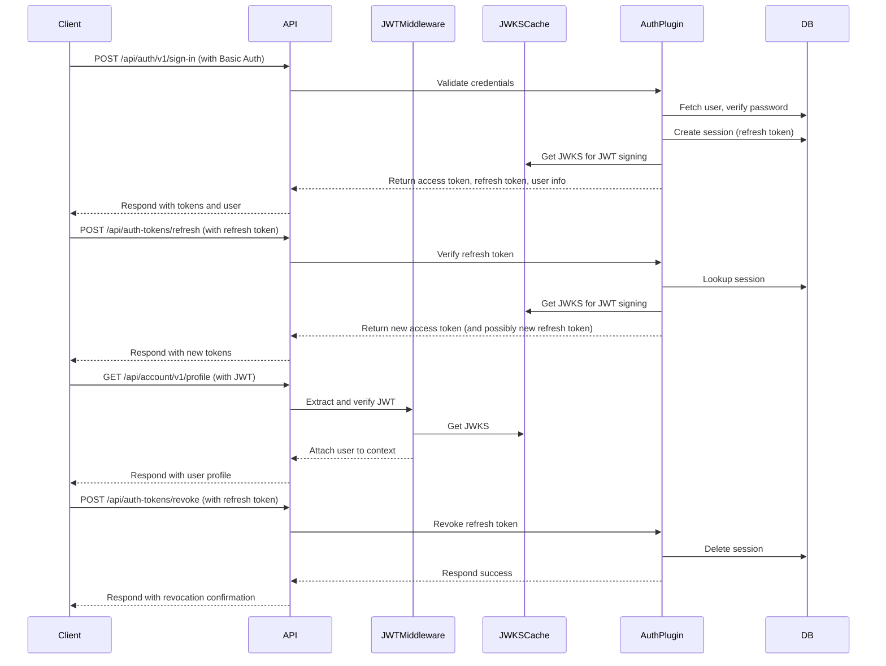

# Astro Starter Kit

A feature-rich web application starter template built with Astro, React, TailwindCSS, Better Auth, Drizzle ORM.

## Getting Started

```bash
pnpm install
cp .env.example .env
pnpm run dev
```

## 🚀 Tech Stack

- **[Astro](https://astro.build)** - Fast, modern web framework
- **[Svelte](https://svelte.dev)** - UI component library used for component hydration
- **[TailwindCSS](https://tailwindcss.com)** - Utility-first CSS framework
  - With Typography plugin for elegant content styling
- **[Shadcn UI](https://next.shadcn-svelte.com)** - UI component library
- **[Better Auth](https://better-auth.com)** - Authentication system
- **[Drizzle ORM](https://orm.drizzle.team)** - TypeScript ORM
- **[Resend](https://resend.com)** - Modern email API for sending emails

## 🛠️ Features

- **Server-side Rendering** with Astro's Node adapter
- **Type Safety** with TypeScript
- **User Authentication** flow with Better Auth
- **Database Integration** with Drizzle ORM
- **Modern UI** with TailwindCSS v4
- **Email Functionality** with Resend API and templating using React Email
- **Development Tools**: Prettier for code formatting

## 🧞 Commands

| Command         | Action                                   |
| :-------------- | :--------------------------------------- |
| `pnpm install`  | Installs dependencies                    |
| `pnpm dev`      | Starts local dev server with DB setup    |
| `pnpm build`    | Build your production site with DB setup |
| `pnpm preview`  | Preview your build locally               |
| `pnpm astro`    | Run Astro CLI commands                   |
| `pnpm db-setup` | Generate and push Drizzle migrations     |

## ☑️ New Project Checklist

- [] Add a KV session namespace then add binding to `wrangler.jsonc`
- [] Remove `wrangler.jsonc` from `.gitignore`
- [] Update `wrangler.jsonc` with your project details
- [] Delete `example.wrangler.jsonc` with your project details
- [] Copy `example.env` to `.env` and update with your project details
- [] Update project name in `package.json`
- [] Get D1 database ID, Account ID, and Token from Cloudflare Dashboard/ More info [here](https://orm.drizzle.team/docs/guides/d1-http-with-drizzle-kit)
- [] Add D1 database ID, Account ID, and Token to `.env`

## 🔐 Authentication

1. **Sign Up**: Users can create an account with name, email, and password
2. **Sign In**: Users can log in with their email and password
3. **Protected Routes**: The dashboard is protected and requires authentication
4. **Sign Out**: Users can log out from their account

### Astro Session

The Astro Sessions API allows you to easily store user data between requests.
This can be used for things like user data and preferences, shopping carts, and
authentication credentials. Unlike cookie storage, there are no size limits on
the data, and it can be restored on different devices.

Before using sessions, you need to create a KV namespace to store the data and
configure a KV binding in your Wrangler config file.

```bash
pnpm wrangler kv namespace create "SESSION" # default name
```

Add the returned ID to `wrangler.jsonc`:

```json
"kv_namespaces": [
  {
    "binding": "SESSION",
    "id": "<KV_NAMESPACE_ID>"
  }
]
```

## 🗄️ Database

This template uses Drizzle ORM with Cloudflare D1 for a modern, type-safe, serverless SQL database.

- The schema is defined using Drizzle's sqliteTable helpers for tables.
- The Drizzle config (drizzle.config.ts) auto-detects local vs. production and sets up credentials for Drizzle Kit.

### Database Schema

The database schema includes:

- Users
- Sessions
- Accounts
- Verification tokens
- Todos (user tasks)

### Migrations

- Run `pnpm db:generate` to generate migrations from your schema.
- Run `pnpm d1:migrate:local` to apply them locally.
- Run `pnpm d1:migrate:prod` to apply them to production.

To apply migrations to your production database, you'll need to set up a D1 database in Cloudflare and add the following environment variables:

- CLOUDFLARE_DATABASE_ID
- CLOUDFLARE_ACCOUNT_ID
- CLOUDFLARE_TOKEN

See the checklist above for more details.

> **Note:** You need to manually apply the migrations to your production database after every schema change.

### Studio

You can use the Drizzle Studio to view and edit your local database data.

```bash
pnpm d1:studio:local
```

## 📊 Database Queries

Here's an example of how to fetch a user's todos from the database using Drizzle ORM:

```typescript
import {eq} from "drizzle-orm";
import {db} from "@/db";
import {todo, user} from "@/db/schema";

// Fetch all todos for a user
const todos = await db
  .select()
  .from(todo)
  .where(eq(todo.userId, currentUserId));

// Create a new todo
const newTodo = await db
  .insert(todo)
  .values({
    title: "Build an Astro app",
    completed: false,
    userId: currentUserId
  })
  .returning();

// Update todo status
await db.update(todo).set({completed: true}).where(eq(todo.id, todoId));

// Delete a todo
await db.delete(todo).where(eq(todo.id, todoId));

// Join example: Fetch todos with user info
const todosWithUser = await db
  .select({
    id: todo.id,
    title: todo.title,
    userName: user.name
  })
  .from(todo)
  .leftJoin(user, eq(todo.userId, user.id))
  .where(eq(todo.userId, currentUserId));
```

## 📨 Email Functionality

The application includes built-in email functionality using [Resend](https://resend.com) with fallback to SMTP/Ethereal for development.

### Configuration

Add these environment variables to your `.env` file:

```env
# Resend API configuration (recommended for production)
RESEND_API_KEY=your_resend_api_key
SEND_EMAIL_FROM="Your App Name <noreply@yourdomain.com>"

# Alternative: SMTP configuration
# SMTP_HOST=smtp.example.com
# SMTP_PORT=587
# SMTP_USER=username
# SMTP_PASS=password
# SMTP_SECURE=false
```

### Email Templates

Email templates are built with React Email for improved type safety, maintainability, and design consistency. Templates are stored in `src/emails/`:

- `WelcomeEmail.tsx` - Template for welcome emails
- `CustomEmail.tsx` - Template for custom message emails
- `BaseLayout.tsx` - Reusable email layout component

### Sending Emails

```typescript
import {sendEmail} from "../utils/email";

// Send a welcome email
await sendEmail({
  to: "user@example.com",
  subject: "Welcome to Astro Starter!",
  template: {name: "welcome", params: {name: "John"}}
});

// Send a custom email
await sendEmail({
  to: "user@example.com",
  subject: "Important Information",
  template: {name: "custom", params: {html: "<p>Your custom message here</p>"}}
});
```

### Sending Test Emails

Visit `/email-demo` to try the email functionality. In development, emails are sent to Ethereal (a test SMTP service) and you'll see preview links in the console.

### Preview Emails Templates

To preview emails locally, run:

```bash
pnpm email-preview
```

This command starts a local email viewer using the templates from the `src/components/email` directory.

## API

The API is built using Hono and comes with a hybrid JWT and refresh token authentication system, primarily for mobile applications.



## 📚 Learn More

- [Astro Documentation](https://docs.astro.build)
- [Better Auth Documentation](https://github.com/zenstackhq/better-auth)
- [Drizzle ORM Documentation](https://orm.drizzle.team/docs/overview)
- [TailwindCSS Documentation](https://tailwindcss.com/docs)
- [Svelte Documentation](https://svelte.dev/docs)
- [Resend Documentation](https://resend.com/docs)
- [React Email](https://react.email/docs/introduction)

## Resources

- [Shadcn UI Blocks](https://www.shadcnui-blocks.com/)
